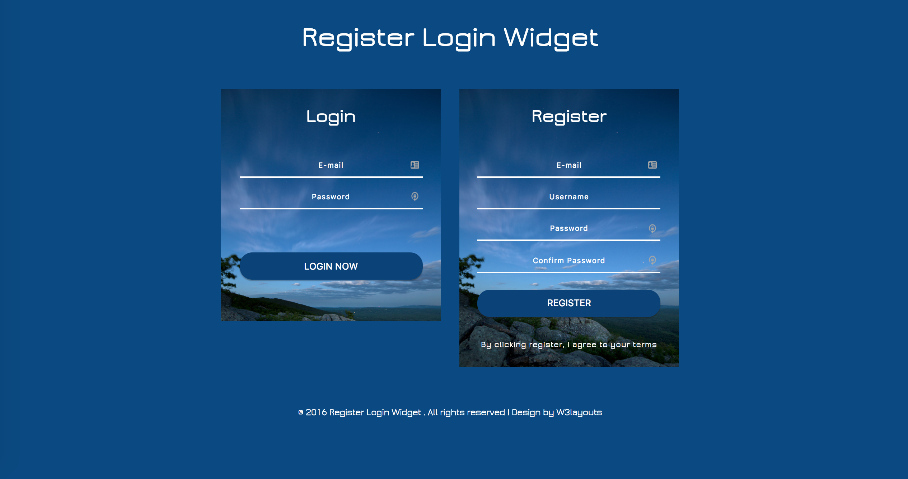

## 📝 Author

##### Daniel Deutsch <kbd>[Github](https://github.com/DDCreationStudios) / [FreeCodeCamp](https://www.freecodecamp.com/ddcreationstudios) / [CodePen](http://codepen.io/ddcreationstudios/) / [LinkedIn](https://www.linkedin.com/in/daniel-deutsch-b95611127) / [Medium](https://medium.com/@ddcreationstudi) / [Hashnode](https://hashnode.com/@DDCreationStudio) / [Site](http://ddcreationstudios.at/) /  [E-Mail](mailto:deudan1010@gmail.com)</kbd>

# 🌐 Authentication Example with Node.JS and MongoDB [App Progress Status](https://img.shields.io/badge/Status-Finished-0520b7.svg?style=plastic)

A simple dynamic Node.js app for displaying treehouse profile data. 

Check out my [post on medium.com](https://medium.com/@ddcreationstudi)

Start with treehouse here:
